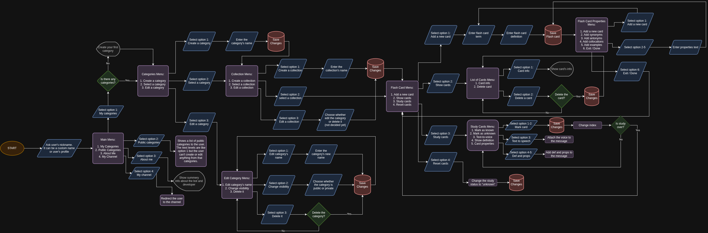

# Flashcard Telegram Bot

The diagram:



# Translation:
1. Extract the messages:
```
pybabel extract -o messages.pot .
```

2. To update the .po file, use this command:
```
pybabel update -i messages.pot -d locales
```

3. To compile them, use this command:
```
pybabel compile -d locales
```